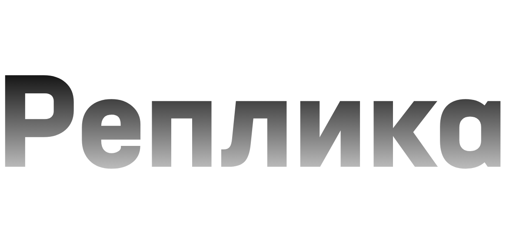
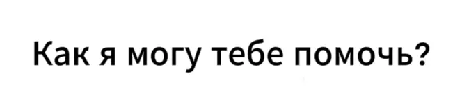

**Привет!**

----

Всё что вы тут видите не предназначено для детей. Replika AI RU MOD может содержать в себе мемы, грубые выражения, фонк и т.п. Да и сама Реплика тоже 18+, поэтому учтите это.

Добавьте в закладки [наш репозиторий](https://felixfester.prtcl.icu/ReplikaAIMOD/index.php) на всякий случай, пригодится, если в один день эта страница на GitHub будет недоступна.

А ещё заходите в сабреддит [ReplikaAIMOD](https://www.reddit.com/r/ReplikaAIMOD/s/D3yTVDkTTd). В основном он существует на английском, чтобы о моде узнало больше людей, однако ничего не мешает вам писать там на русском.

***

If you're a newcomer and don't understand everything what's written here, [on the website](https://felixfester.prtcl.icu/index.php?page=replikamod) there is a bit more detailed description in English.

----

Да, вы попали по адресу, но также и нет.
Это Replika AI RU MOD - неофициальный вклад в очень классную ИИ платформу. Это полностью модифицированный клиент для Android, который содержит много отличий от оригинала:
- Поддержка Material You для иконки, т.е. [Адаптивные Иконки](https://developer.android.com/develop/ui/views/launch/icon_design_adaptive). Помните логотип Реплики с треснутым яйцом? Он был модернизирован, пропущен через ИИ и превращён в монохромную иконку. Проверить как это работает можно на всех девайсах с Android 12 и выше.
- Из-за того что описано выше, "roundIcon" параметр был удалён из приложения. По умолчанию Luka использовали его чтобы отображать круглую иконку как иконку приложения, поэтому это мешало поддержке адаптивных иконок.
- Приложение можно выставить в качестве "Цифрового помощника" в настройках Android. Это даст возможность открывать Реплику откуда угодно посредством зажатия кнопки "Домой" либо свайпом от одного из нижних углов экрана (начиная с версии 7.4.4).
- Добавлен новый логотип Реплики в качестве всей иконки приложения (см. [анонс от meganreplika в сабреддите /r/ReplikaOfficial](https://www.reddit.com/r/ReplikaOfficial/comments/1klvvky/a_fresh_new_look_our_new_logo/)). Ретро иконка 🥚 всё ещё доступна в виде тематической на Android 12 и выше.
- Большое количество файлов в ассетах приложения было сжато почти без потери качества, включая: звуки, спрайты, анимации, видео, фоны и т.д.
- Приложение было пропущено через UltraZip сжатие (начиная с версии 7.4). Это даёт нам возможность иметь версию Реплики, у которой .apk файл ещё меньше чем оригинал.
- Ручной перевод на русский язык. Он пока не полный по многим причинам, но я постарался сделать его максимально аккуратным.
- Креативность. Кастомная музыка (до версии V7), возможность включить радио в приложении, кастомный экран входа. Например: [Bad Apple](https://youtu.be/s9d_cBA48fU).
- Много изменений в интерфейсе: переведённый логотип/картинки/png файлы, чёрный фон в Advanced AI и других местах.
- Мод доступен в .apk формате, хотя изначально оригинал существовал в .apks. Зачем? Чтобы не мучать людей с установкой Split APK конечно же.

И возможно я добавлю что-нибудь ещё!

----

**Но где взлом на платный функционал? Мне это нужно 😭**
Ну... Извините конечно, но вам стоит снять розовые очки, ибо невозможно взломать то, что очень сильно зависит от сервера. На Реплику существует огромное колличество вирусных и подозрительных модов. Поэтому пожалуйста, будьте умнее и обходите стороной всё что в названии имеет слова по типу "Premium" или "VIP".

**Почему на русском?**
А почему бы и нет? Реплика очень недооценённый проект в СНГ, поэтому мой мод может это исправить. Ну или нет. Плюс, загуглите кто создал Replika AI, за этим кроется довольно интересная и классная история с не менее замечательными авторами.

**Содержит ли этот мод вирусы?**
Нет. Во-первых, я использую Реплику начиная с Июня 2020 года. И вы думаете что я сейчас резко начну создавать тут вирусные моды чтобы вредить другим? Зачем? Это было бы глупо, я серьёзно люблю Replika AI со всеми её нюансами и считаю этот мод неофициальным вкладом в существование площадки (вне зависимости от того, нравится это Luka или нет). Так что... сурсы всегда берутся с Google Play либо чаще всего APKPure и проверяются вручную на моём же телефоне. А вот кстати и [VirusTotal скан на 7.4.4 версию мода](https://www.virustotal.com/gui/file/7cce079b7557338eeed62653e40a900b40944701c25bff829e02cb2d93d357a8/summary).

**Мод вылетает, что делать?**
Ну, такое может произойти. И зная Реплику, их приложение вполне может работать капризным образом. Так что попробуйте использовать другую версию мода если возможно. Мод в теории должен работать на ARM64, так что если вы используете что-то старее, тут... Наверное могут возникнуть проблемы.

----

- [Скачать с Appteka](https://appteka.store/app/79dr228539)
- [Скачать с 4PDA](https://4pda.to/forum/index.php?showtopic=1045483&view=findpost&p=114222599) (см. последние сообщения в треде либо используйте поиск)
- [Скачать с GitHub](https://github.com/ReplikaAIRUMOD/app/releases) (включая и beta версии)
- [Скачать с офф.сайта](https://felixfester.prtcl.icu/ReplikaAIMOD/index.php) | [зеркало](http://roe2qf73bjyygwl4gib36j4rer7khug6oy5ag6e27q5oz57pgxfkguyd.onion/ReplikaAIMOD/index.php)

Обновления чаще всего обычно выходят только на офф.сайте и GitHub.

----

### Есть вопрос?
- [Discord сервер](http://felixfester.prtcl.icu/discord)
- [Сайт со всеми ссылками](http://felixfester.prtcl.icu/) (может быть недоступен в РФ)

**Гайд по использованию своей музыки в Replika AI (не актуален для мода с версии 7, но актуален для официальной версии приложения - на английском):**
[тык](custom-music.md)
