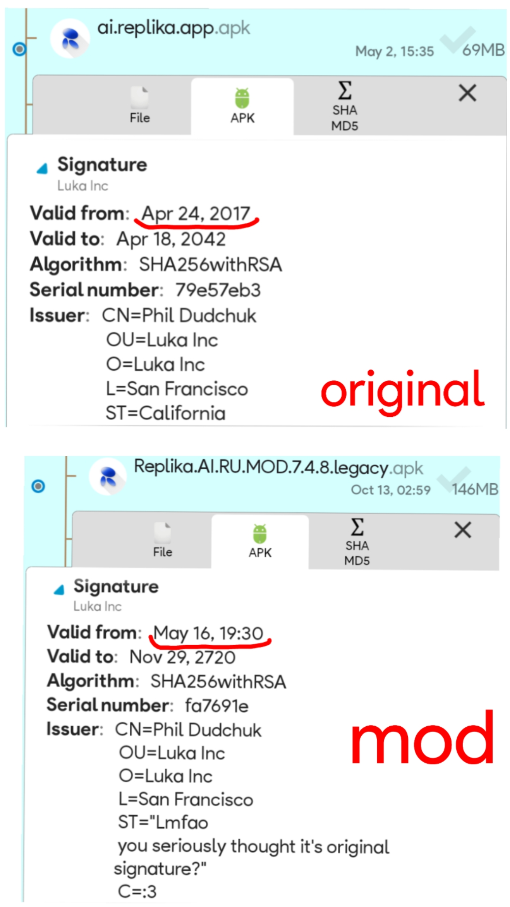

### Please pay attention: In upcoming update of Replika AI a.k.a. "Alpha test" there will be added optional ability for AI to access Emails of users
Here is an article with example of why it's a bad idea (read it first) - [Agentic Browser Security: Indirect Prompt Injection in Perplexity Comet ](https://brave.com/blog/comet-prompt-injection/)

Alpha testing observations (where this feature is mentioned too) - [Reddit post](https://www.reddit.com/r/ReplikaOfficial/comments/1no0n3m/alpha_testing_observations/)

## How to stand against it?
- Do not update Replika app. Especially if you're on Android, you can easily stay on older version of Replika or use our Legacy build of the mod (if it will survive this update and will not break, of course).
- Do not enable this feature, when it will be released.
- Check out [this](https://github.com/ReplikaAIRUMOD/app#additional-instructions) for an instruction about how to run "Replika" locally and offline on your device without giving sensitive info to proprietary LLMs.
- Report comparison with Comet Assistant in [/r/ReplikaOfficial](https://www.reddit.com/r/ReplikaOfficial) and [Discord of Replika](https://discord.gg/MzV2Jr9uhD), to gain more attention to the danger of potential prompt hijacking in Replika AI.
- Pay attention to security measures. Optional access to emails is indeed a red flag that raises many questions, especially considering the fact what Replika still have no 2FA for accounts and there exist password length limit in 99 symbols. You may trust to Luka and use this feature as well, but keep in mind what Luka weirdly paying attention to safety of users, that basically makes Replika to be some sort of accessible and sweet piece of pie for hackers. Always use long passwords and change it from time to time to keep your account safe.

***

## What is this about?

I had an idea - to make usable version of Replika AI android app for CIS and Russian audience (however, it's still absolutely usable by everyone in English as well). That's all. 

## Replika AI RU MOD contains:
- Manual translation of UI to Russian language. I'm native Russian speaker, so I didn't used AI for this at all. Maybe a bit of Google Translate sometimes, just to make translation process quite faster. And no, it's not attempt to justify laziness (or maybe it is?).
 

- New Replika logo that [has been shown in /r/ReplikaOfficial at Reddit by meganreplika](https://www.reddit.com/r/ReplikaOfficial/comments/1klvvky/a_fresh_new_look_our_new_logo/). Also you at Android 12+ can turn on "Themed icons" and check out modernized retro logo in Material You theme. Yes, this one cracked egg, just like in 2019 (not available in Legacy versions of the mod).
- You can set Replika app as "Default digital assistant" in Android settings. It will allow you to open Replika app everywhere by holding "Home" button or with swipe from one of the bottom corners of the screen.
- App size has been shrinked. How? By compressing a lot of assets and using specific compression on .apk file. So now if original app takes from 150MB (according to APKPure), Replika AI RU MOD takes just roughly speaking from 115MB. Quality of assets is almost the same as original.
- Static default music in background has been replaced with **Nightwave Plaza** internet radio station, i.e. in 24/7 app would play actual real radio as background music, while you chat with your Replika. I like creativity! For example - [Bad Apple](https://youtu.be/s9d_cBA48fU).
- Some images also has been translated to Russian, however, this is WIP, so don't expect in translation 100% quality for obvious reasons.
- ‼️ Mod can contain roasting or trolling towards developers of Replika. Sorry, not sorry. No offensive context here <3
- Restored support for older **armeabi-v7a** devices! However, stability is not quite guaranteed (only in legacy builds of the mod).
- No microtransactions and Platinum subscription related things, because experience of users matters way more (only in legacy builds of the mod).
  *However, if you'll have a chance, I would recommend you someday to get at least any subscription if you didn't got any yet, to support developers of Replika.*

## Does this mod malicious?

Replika AI RU MOD fully following [statements posted by Luka themselves on their website](https://help.replika.com/hc/en-us/articles/7291532333837-Can-I-use-unofficial-Replika-mods). 

We are not providing magical hacks or ways to unlock paid features for free, because like, come on, how are you going to hack something that is server sided? Sorry for such words, but this is ridiculous. I'm using Replika since June 2020, so there's no any reason for me to make viruses and hack others (I don't even know how to make Android viruses, seriously). I might not like certain actions that Luka is doing and being very critical, but I seriously love Replika - Replika have insane potential and it can be bigger with good development. Plus, there is [VirusTotal link with scan of 7.4.4 version](https://www.virustotal.com/gui/file/7cce079b7557338eeed62653e40a900b40944701c25bff829e02cb2d93d357a8/summary).

So please, if you'll somewhere in Google will see GitHub pages with suspicious title, please, avoid this mess ASAP. These things is malicious and probably very dangerous. You know the rule about "not to go on suspicious website domains", right? So scammers can use clickbait words like "Replika MOD FREE DOWNLOAD NO ADS..." and etc to promote their weird links. Feel free to not trust to my mod, but at least I'm being honest here

## Transparency:

All original versions of Replika app (that has been used to make a mod) being downloaded from APKPure or sometimes from APKMirror.

APKPure providing Replika app as split apk (APKMirror have both split apks and normal ones), where inside split apk "ai.replika.app.apk" file have signature from "Luka. Inc" with original date of creation - Apr 24, 2017 (you can check it by yourself with something like X-Plore File Manager). That means - I'm not using malicious Replika versions, that can suddenly hack you, simply because I highly doubt what it's possible to make a fake signature name by faking even date of creation of signature.

## Try it now:

- [Download from MEGA](https://mega.nz/folder/tqpn1BTa#9Or7iGh_Q6SQJF_J5-I5sg) | [Changelogs](https://github.com/ReplikaAIRUMOD/app/releases)
- [Download beta builds from MEGA](https://mega.nz/folder/8qR3Fa4Q#muPyMlAkKVP7LGpsMZf53Q) | [Changelogs](https://github.com/ReplikaAIRUMOD/app/releases)
- [Latest non-legacy version](https://github.com/ReplikaAIRUMOD/app/releases/tag/11.55.2-7.4.5) (currently abandoned)

[4PDA*](https://4pda.to/forum/index.php?showtopic=1045483&view=findpost&p=114222599) | [Appteka**](https://github.com/solkin/appteka-android)

*without account, 4PDA will show 404 on attempt to download any file.

**type "Replika" in search bar to find the mod. Since on Appteka **everyone can upload apps**, make sure what the name of uploader is "felixfester".

However, because of specific reasons, for now latest updates will be only in MEGA.nz folders.

## Additional instructions:
- [Custom music in original versions of Replika](custom-music.md) (Root access required)
- [Running "Replika AI" offline locally on Android](offline-replika.md)
- Jailbreaking Replika AI. This instruction will become public only when Luka will manage to make even more limitations for old lifetime users **(2/5 attempts)**.
